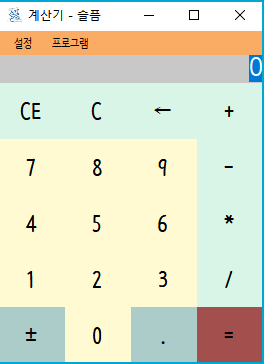

# Eesy-Cel

간단한 계산기

## Download

- [Windows x86 zip file](./build/Eesy-Cel_x86_0.0.1.zip?raw=true)

## Info

- 사칙연산 기능이 있는 계산기 입니다. 
- 테마기능이 있어 사용자가 원하는 디자인으로 변경이 가능합니다.

## How to Install

- zip파일을 다운로드 받고 압축을 해제 합니다.

## How to Delete

- 압축 해제한 폴더를 지우거나 프로그램을 지우면 됩니다.

## What did you learn?

- 테마 기능을 구현할 때 어떤 점을 고려해야하는 지를 알게 되었습니다.
  1. 일정한 규칙이 있어야 합니다.
  2. 간단해야합니다.
  3. 테마 설정을 위한 함수를 제공해야 합니다.
- C#에 대해 공부할 수 있는 계기가 되었습니다.

## Finally

- `무엇이든 한번 해보자` 프로젝트 중 하나 입니다. 
- `(`, `)` 기능을 추가해서 계산을 할 수 있는 기능을 추가할 예정입니다.

## Modify Content

- 2017-11-29 ( 0.0.1 )
  - 기능 구현

## Copyright

- 비상업적 용도로 사용 가능하며 링크를 반드시 포함해주세요.
- 문제가 되는 내용이 있다면 언제든지 [`issue`](https://github.com/Sotaneum/Eesy-Cel/issues/new), [`Pull requests`](https://github.com/Sotaneum/Eesy-Cel/compare) 부탁드립니다.